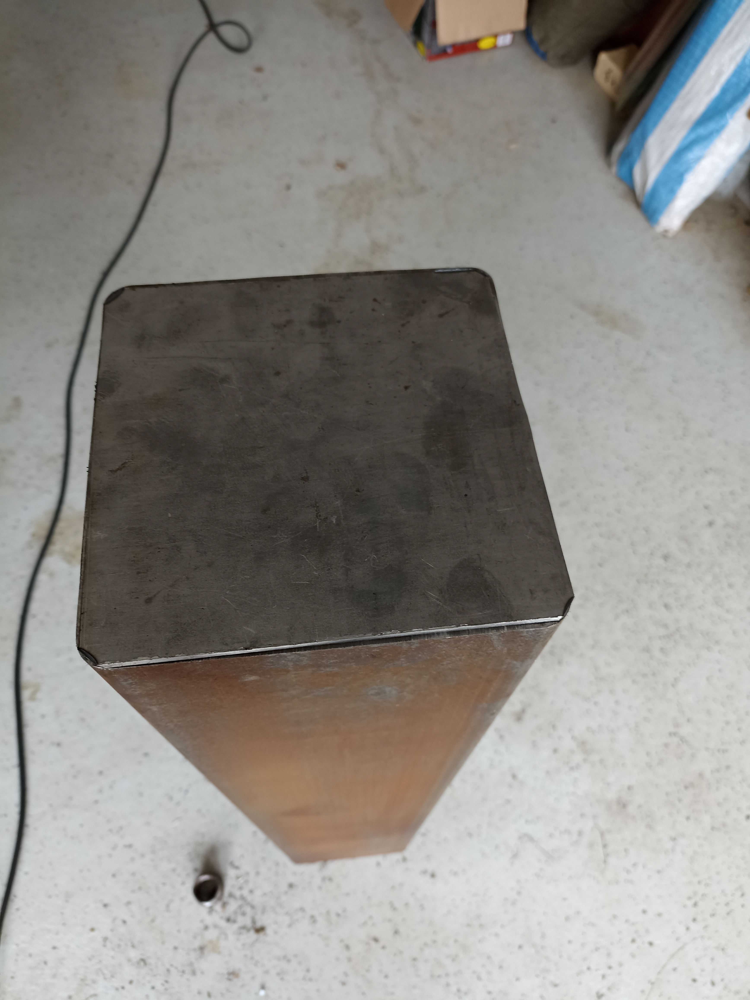

# Plep-Miner
Conversion of an Antminer S9 to a Bitcoin Water Heater (Heizungswasser und Brauchwasser).

## Disclaime

Ich bin kein gelernter Elektriker, kein Schlosser und auch kein Heizungsbauer.
Diese Projekt endstand unter Rücksprache mit einem Elektro- und Schlossermeister.

## Vorwort
Diese Idee ist daraus entstanden, Bitcoin Mining für jeden, der möchte einfach und auch wirtschaftlich sinnvoll zu betreiben.
Nur so werden wir meiner Meinung nach langfristig die Rechenleistung für das Netzwerk weiter dezentralisieren können

## Wie sieht es fertig aus?

# Benötigtes Werkzeuge und Material

## Werkzeug
- Schweißgerät
- Winkelschleifer
- Trennscheiben
- Standbohrmaschine
- 1 Zoll Metallbohrer
- Schneidöl
- Akkuschrauber
- Steinbohrer
- Rohrzange
- Abisolierwerkzeug
- Spitzzange
- Cuttermesser
- Metallsäge
- Lötbrenner
- Lötzinn

## Material
- Drei Antminer S9/S9i/S9j mit funktionsfähigem Netzteilen
- 1-2 Liter Ethanol / Isopropanol
- 1x 1m Vierkantstahlrohr 180mm x 180mm x 5mm
- 1x Stahlplatte min. 170 x 170 x 4mm
- 4x Winkelverbinder 100 x 100 x 50 mm
- 3x U Winkelverbinder 90 x 90 x 90 mm
- 1x Warmwasserpumpe (z.b. gebraucht Heizungspumpe)
- 1x Pumpenverschraubung + Gummidichtung
- 20l Isolieröl z.B. Shell Diala S4 ZX-I
- 1x Plattenwärmetauscher mit 3/4 Zoll Anschlüssen
- 2x 1 Zoll Innengewinde Muffe
- 1-2x Rollen Teflonband
- 1x M10 Gewindestange 1 Meter
- 2x M2 Gewindestange 1 Meter
- 4x M2 Beilagscheibe, M2 Mutter
- 1x 2,5m 4x16mm2 Kabel
- 24x Kabelschuhe 16mm2 M6
- 1x Schrumpflauch für 16mm2 Kabel
- 2x Panzerschlauch 3/4"ÜM x 3/4"ÜM Bogen

    
## Schritt 1 - Miner Vorbereiten

Die Miner auf Funktionstüchtigkeit prüfen. Miner mit PSU durch die 10 6Pin Stecker verbinden. Dann Ethernet in den Ethernet-Port stecken und mit dem Router verbinden. Anschließend den Kaltgerätestecker in das Netzteil stecken und der Miner startet.

## Schritt 2 - Miner zerlegen

Nachdem wir den Miner auf Funktionstüchtigkeit geprüft haben, wird er zerlegt und gereinigt. Zuerst werden die Kabel des Netzteils entfernt und die Datenkabel zwischen Hashboard und Controller ebenso entfernt. Dann die Lüfter Schrauben rausdrehen, um beide Lüfter zu entfernen.
Im Anschluss entfernen wir die Blende auf der Hashboard Seite, diese ist durch weitere 4 kleine Schrauben befestigt.

Nun werden die Hashboards aus dem Alu Gehäuse einfach herausgezogen und zur Seite gelegt.

Das Control Board kann einfach durch das Zuseiteschieb der beiden Federklemmen aus dem Gehäuse entfernt werden.

## Schritt 3 - Miner reinigen

Wir nehmen einen lösemittelbeständigen Behalter etwas größer als das Hashboard und befüllen diesen mit Ethanol. Dort geben wir jetzt das erste Hashboard hinein und reinigen es mit einem Pinsel. Einfach über die PCB sowie durch die Kühlrippen pinseln, um Staub oder andere Verschmutzungen (z.B. Fliegen) zu entfernen.
Im Anschluss legen wir es zum Trocknen, so dass sich das Ethanol wieder verflüchtigen kann. Diesen Vorgang wiederholen wir nun für alle weiteren Hashboard- sowie Control Boards.

## Schritt 4 - Alu Gehäuse vorbereiten

Wir entfernen die Frontblende wie bereits auf der Hashboardseite. Danach können wir die Halterung für den Controller aus dem Gehäuse herausziehen. Diese Controller Halterung müssen wir jetzt mit der Flex bearbeiten. Wir entfernen die hinteren 4,5 cm der Alu Feder mit der die Halterung in das Alu Gehäuse gesteckt wird
um diese näher an die Hashboards heran zu schieben.

Danach werden die Controller Halterungen alle wieder auf das Alu Gehäuse geschoben , 4,5cm weiter nach hinten als vorher.

## Somit sind die Miner gereinigt und die Alugehäuse für den Verbau vorbereitet nun geht es an das Heizungsrohr

## Schritt 5 Heizungsrohr - Bodenplatte

Schneidet die Bodenplatte auf das Maß 175mm × 175mm, um eine bessere Auflage für das Verschweißen zu haben.

Nehmt euch eine der abgeschraubten Blenden zur Hand und platziert diese in eine der Ecken der Bodenplatte und überträgt die Maße auf die Bodenplatte.
 
Danach bestimmt ihr den Mittelpunkt des Miner auf eurer Bodenplatte, um das Bohrloch auf der Bodenplatte zu erhalten.

## Schritt 6 Heizungsrohr - Rohr

Nehmt den Mittelpunkt eures Bohrlochs der Bodenplatte und überträgt diesen Abstand zur Seite auf das Rohr, dann geht von der Bodenplatte 82 cm nach oben und markiert euch das zweite Loch

Danach werden beide Löcher gebohrt.

## Schritt 7- Heizungsrohr schweißen

Zuerst platziert ihr die Bodenplatte mittig auf der Heizungsrohre Unterseite und schweißt diese fest. !!!!! Achtet auf die Platzierung der beiden Löcher!!!!!
Wenn die Bodenplatte dicht geschweißt ist, können wir die Zoll-IG (Innengewinde) Muffen auf beiden Bohrungen mittig festschweißen.

Die Vier Winkelverbinder zur Wandmontage könnt ihr beliebig weit entfernt entsprechen euer Isolierung seitlich an das Rohr schweifen. In meinem Fall waren das 5 cm. Beachtet wie ihr das Rohr mit Wärmetasucher und Pumpe an der Wand Montieren möchtet, links oder rechts.
Gegenüber der Bohrung für den Überlauf am Rohr werden nun die U-Winkelverbinder angeschweißt. Als Abstandshalter habe ich ein Netzteil genommen, um den richtigen Abstand zu bekommen.

##

Wer möchte, kann nun noch das Rohr gegen Rost schützen, indem der die Außenseite lackiert.

## Schritt 8 - Verrohrung

Jetzt wird der Ablauf 1 zu 1 gemäß Bild nachgebaut.
Um die Verschraubung dicht zu bekommen, immer 4 bis 5 Umdrehungen Teflonband auf das Gewinde wickeln und jede Verschraubung mit zwei Wasserpumpenzangen sehr gut anziehen.

Bei der Pumpenmontage auf die Gummidichtung achten und nicht die Papierdichtungen des Pumpe und/oder der Pumpenverschraubung verwenden. 
!!!Papierdichtungen dichten mit Öl nicht ab :D.!!!

##Schritt 9 - Miner Verbinden
Hashboard wieder in die Miner hineinschieben und die Blenden nur auf der Oberseite wieder mit den Schrauben befestigen, so dass die Hasboards nicht herausrutschen.
Miner hintereinander platzieren und die M2 Gewindestange durch die Nut im Gehäuse durch alle Miner durchschieben.
Beilagscheiben und Mutter anbringen und die Drei Miner miteinander verschrauben.

## Schritt 10 - Miner Verkabelung

!!!!!Netzteil nur Stromlos und nicht angesteckt zerlegen!!!!!

Jetzt benötigen wir die Netzteile. Motorabdeckung abschrauben, pro Seite 3 Schrauben. die Netzteilkabel mit einem Inbus schrauben.
Netzteil zur Seite legen, wir machen jetzt nur mit den Kabeln weiter.

6 Pin Stecker an den Hashboards und an den Control Board einstecken. Das 4m16mm2 Kabel an einer Seite abisolieren und auf jeder Ader einen Kabelschuh schieben und neben die Kabelschuhe der 6Pin Stecker des ersten (untersten) Miners legen. Nun die Kabellänge messen. Diese sollte, wenn wir von Anfang untersten Miner messen, 160 cm betragen. Beim zweiten Kabelstück für den mittleren Miner sind das 100 cm Kabel und für den obersten Miner sind 80 cm ausreichend.

Nun müssen wir schauen, wie unterschiedlich weit wir mit 6 Pin-Kabeln pro Miner kommen da ergibt sich immer ein Versatz und den benötigten wir auch in unserem Anschlusskabel. Dann auf die entsprechende Länge abisolieren und die Kabelschuhe mit Schrumpfschlauch auf den Kabelenden festlöten.
Das andere Kabelende lassen wir unberührt.

Im Anschluss die Kabelschuhe der 6Pin Kabel mit unserem Verlängerungskabel verschrauben und auch dort einen Schrumpfschlauch nicht vergessen.

!!!!!!! Wichtig Farbschema Kabel !!!!!!!!!!  

Das 4x16mm2 Kabel wird in der Regel mit zwei farbigen Adern und zwei schwarzen/grauen Adern ausgeliefert. Verbindet IMMER die zwei Schwarzen Kabelschuhe der 6Pin Stecker Kabel mit den schwarz/grauen Adern und die Gelben Kabelschuhe IMMER mit den farbigen Adern.
Grund ist die Endmontage am Netzteil. Zu dem Zeitpunkt seht ihr nicht mehr wo welche Ader wo angeschlossen ist aber nach der Regel könnt ihr das Farbschemen des PSU übernehmen. Die erhöhten Kontakte SCHWARZ und die tieferen GELB/FARBIG
    
## Schritt 11 - Miner kommt ins Rohr

Jetzt schließen wir die Ethernetkabel an den Miner an und schauen das alle 6Pin Stecker sowie die Datenkabel richtig stecken. Dann die Miner in das Heizungsrohr bis auf Anschlag einschieben.

## Schritt 12 - Miner Wandmontage

Schneidet euch 10 bis 12 cm lange Stücke von der M10 Gewindestange, diese werden entsprechend der Löcher in den Winkeln in der Wand mit Dübeln befestigt, um die Heizung zu halten.
Nun am Besten zu zweit das ganze Paket nehmen und auf die 4 Gewindestangen schieben und mit Muttern fest verschrauben.

## Schritt 13 - Netzteile Verkabeln

Steckt nun die Netzteile ohne Abdeckung an die U-Winkelhalter. Jetzt können wir die Länge der Kabel fix bestimmen. Denkt an das Farbschema der Kabel die erhöhten anschlüsse sind die SCHWAZ/GRAUEN und die Tiefen die GELB/FARBIGEN Anschlüsse.

Biegt euch das Kabel so hin, dass ihr ohne Spannung im Netzteil das Kabel montieren könnt, markiert euch die Länge und schneidet das Kabel ab. Dann Schrumpfschlauch auf die Ader und Kabelschuh anlöten und verschrauben. Diesen Vorgang mit jeder Ader von jedem Netzteil / Meiner wiederholen

Dann Deckel wieder auf das Netzteil schrauben, nicht vergessen.

## Schritt 14 - Miner in ÖL

Wenn der Miner an der Wand hängt, vergewissern wir uns noch einmal, dass alle Verschraubungen angezogen sind und der Kugelhahn geschlossen ist. Dann können wir das Öl von ober in das Rohr füllen.
Dann erst einmal nur die Pumpe laufen lassen. Blick ins Rohr zeigt, ob das Öl zirkuliert.
20- 30 Minuten warten, ob es zu undichten Stellen  kommt.

## Schritt 15 - Miner Starten

Wenn alles dicht ist und die Pumpe läuft, kann ein Miner nach dem anderen angesteckt werden.

##

Anschluss des Wärmetauscher in ein bestehendes Heizungssystem bitte immer nur durch qualifiziertes Fachpersonal erledigen lassen.

### Jetzt braucht ihr nur noch euren Pool einzustellen und euch für eure Warmwassernutzung in BTC bezahlen zu lassen.

    
## V4V - Support this project

BTC LN: derschweisser@walletofsatoshi.com
